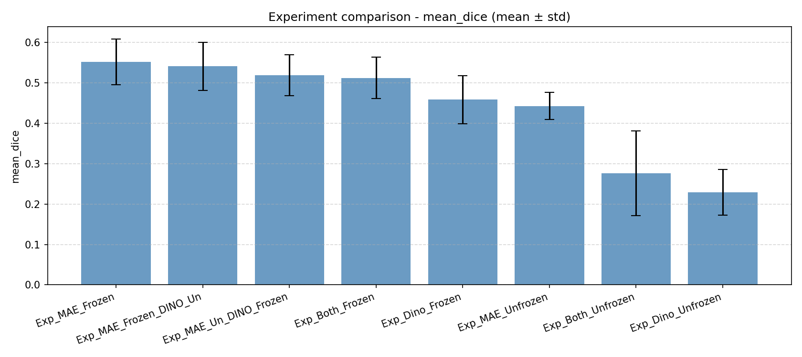
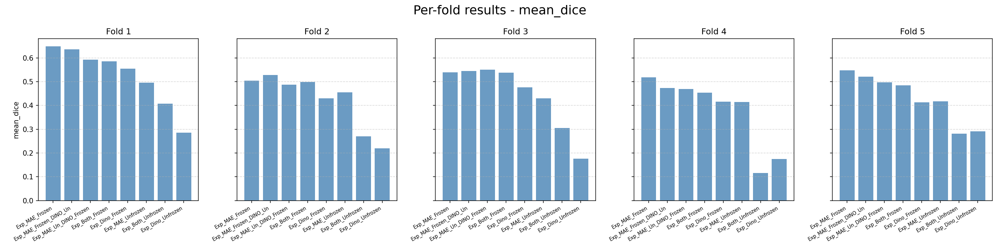
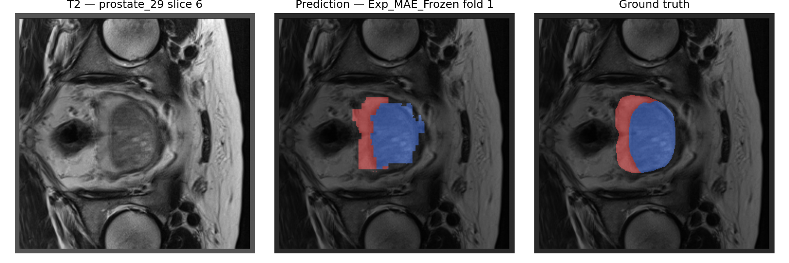
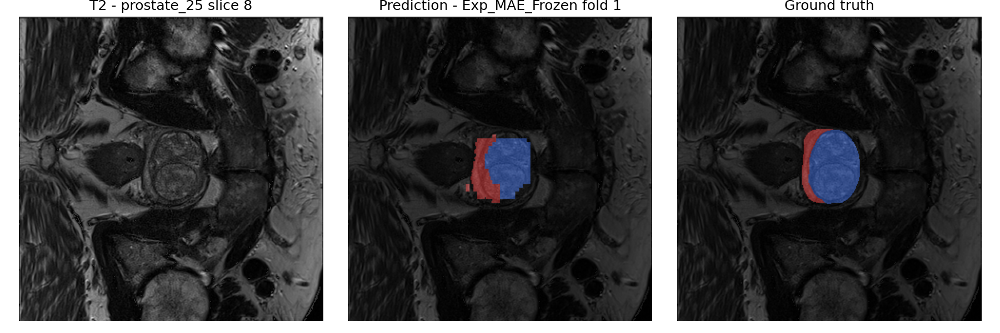
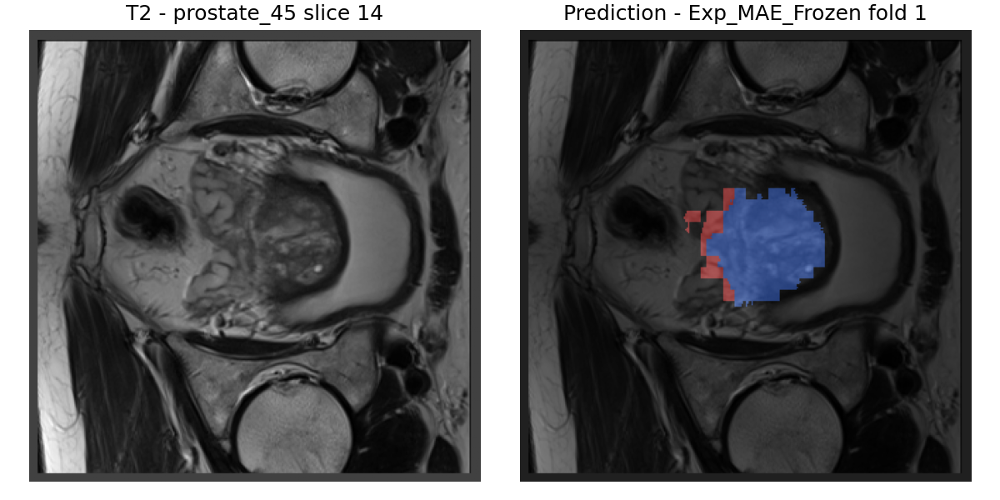
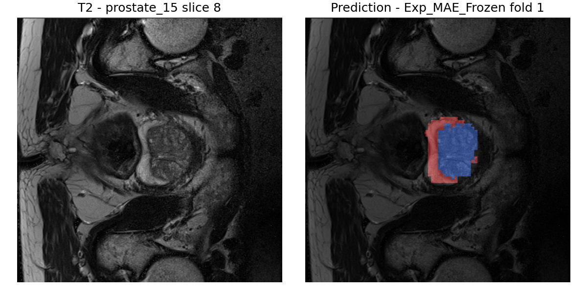
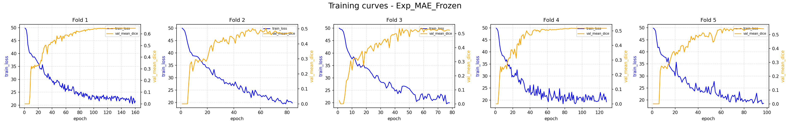
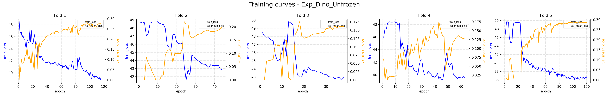
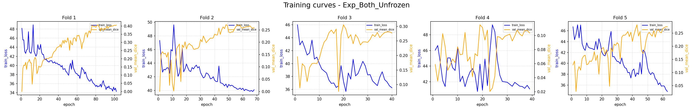

# Prostate Zone Segmentation with Self-Supervised ViT Encoders (MAE & DINO)

This repository contains the implementation for the **auto-supervision** branch of a prostate MRI segmentation project, part of the *Procesamiento de Imagen en Medicina* course (Grado en Ciencia e Ingeniería de Datos, UPCT, 2025/2026).

The task is **Task05_Prostate** from the [Medical Segmentation Decathlon](http://medicaldecathlon.com/): segment the **Transitional Zone (TZ)** and **Peripheral Zone (PZ)** of the prostate from multimodal MRI volumes (T2 + ADC).

---

## Table of Contents

1. [Dataset](#dataset)
2. [Approach](#approach)
3. [Architecture](#architecture)
4. [Experiments](#experiments)
5. [Results](#results)
6. [Qualitative Predictions](#qualitative-predictions)
7. [Project Structure](#project-structure)
8. [Environment Setup](#environment-setup)
9. [Running the Code](#running-the-code)

---

## Dataset

The dataset consists of **48 4D volumes** (32 training + 16 test) from the Radboud University Nijmegen Medical Centre. Each volume contains two MRI modalities stacked along the channel axis:

- **T2-Weighted (T2):** High anatomical contrast, 0.6 × 0.6 × 4 mm resolution. Good for visualising internal prostate structure.
- **Apparent Diffusion Coefficient (ADC):** Functional sequence sensitive to water diffusion, 2 × 2 × 4 mm. Useful for detecting dense/tumoral tissue.

Ground-truth labels have three classes:
- `0` — Background
- `1` — Peripheral Zone (PZ)
- `2` — Transitional Zone (TZ)

Test labels are withheld by the Decathlon organisers.

---

## Approach

Since native 3D versions of MAE/DINO are computationally prohibitive for this scale, the strategy is to **treat each 3D volume as a batch of 2D axial slices** and process them with pretrained 2D ViT encoders. The pipeline:

```
3D Volume (B, C, H, W, D)
    ↓  permute depth → batch dimension
2D Slices (B·D, C, H, W)
    ↓
ViT-Base Encoder(s)  [MAE and/or DINO, pretrained via timm]
    ↓  spatial token grid (B·D, 768, H/16, W/16)
CNN Decoder  [4× ConvTranspose2d + Conv1×1]
    ↓
Segmentation masks (B·D, 3, H, W)
    ↓  reshape back
3D Output (B, 3, H, W, D)
```

**Key adaptations:**
- The ViT patch projection layer is modified from 3 → 2 input channels (T2 + ADC) by averaging the pretrained RGB weights and duplicating them, preserving pretrained knowledge.
- The CLS token is discarded; spatial tokens are reshaped into a 2D grid (20×20 for 320px input with 16px patches).
- A lightweight CNN decoder upsamples 16× back to the original resolution.

---

## Architecture

Three model variants are implemented:

| Script | Class | Encoder(s) | Decoder input dim |
|---|---|---|---|
| `onlymae.py` | `MAEViTSeg` | ViT-Base MAE | 768 |
| `onlydino.py` | `DINOViTSeg` | ViT-Base DINO | 768 |
| `both.py` | `DualViTSeg` | MAE + DINO (concatenated) | 1536 |

The CNN decoder is identical across all variants:

```
ConvTranspose2d(dim, 512, 2×2) → ReLU
ConvTranspose2d(512, 256, 2×2) → ReLU
ConvTranspose2d(256, 128, 2×2) → ReLU
ConvTranspose2d(128,  64, 2×2) → ReLU
Conv2d(64, 3, 1×1)              → logits (3 classes)
```

---

## Experiments

Eight experiments were run using **5-fold cross-validation** (K=5) on the 32 labelled training volumes. Experiments follow the naming convention `Exp_{Encoder}_{State}`:

| Experiment | Encoder(s) | Encoder frozen? |
|---|---|---|
| `Exp_MAE_Frozen` | MAE | ✅ Yes |
| `Exp_MAE_Unfrozen` | MAE | ❌ No |
| `Exp_Dino_Frozen` | DINO | ✅ Yes |
| `Exp_Dino_Unfrozen` | DINO | ❌ No |
| `Exp_Both_Frozen` | MAE + DINO | ✅ Both |
| `Exp_Both_Unfrozen` | MAE + DINO | ❌ Both |
| `Exp_MAE_Frozen_DINO_Un` | MAE + DINO | MAE ✅, DINO ❌ |
| `Exp_MAE_Un_DINO_Frozen` | MAE + DINO | MAE ❌, DINO ✅ |

**Training setup:**
- Optimiser: AdamW (lr=1e-3, weight_decay=1e-5)
- Loss: `DiceCELoss` (MONAI) with λ_Dice=5.0 and asymmetric class weights [1.0, 10.0, 10.0] to counter class imbalance
- Scheduler: `ReduceLROnPlateau` (factor=0.5, patience=5)
- Early stopping: patience=20 epochs on validation Dice
- Max epochs: 1000
- Input size: 320×320×20 voxels (resampled to 0.625×0.625×3.6 mm)

**Data augmentation (training only):**
- Random affine (rotations ±0.2 rad, scale ±10%)
- Random horizontal flip (p=0.5)
- Random Gaussian noise (p=0.1)
- Z-score normalisation per channel (image only)

Two additional ablations were run on `Exp_MAE_Frozen`:
- `Exp_MAE_Frozen_W`: modified class weights [1.0, 15.0, 8.0]
- `Exp_MAE_Frozen_P`: increased early stopping patience to 50, LR scheduler patience to 12

---

## Results

All metrics are reported as **mean ± std over 5 folds**. Metrics:
- **Dice Label 1** — Dice coefficient for Peripheral Zone
- **Dice Label 2** — Dice coefficient for Transitional Zone
- **Mean Dice** — average of the two
- **Mean IoU** — Intersection over Union (foreground classes)
- **HD95** — 95th percentile Hausdorff Distance (mm), lower is better

### Main experiments (`outputs_1_10_10/`)

| Experiment | Mean Dice | Dice PZ (L1) | Dice TZ (L2) | Mean IoU | HD95 |
|---|---|---|---|---|---|
| **Exp_MAE_Frozen** | **0.5515 ± 0.0567** | 0.4285 ± 0.0697 | 0.6746 ± 0.0540 | 0.4034 ± 0.0539 | 12.71 ± 2.76 |
| Exp_MAE_Frozen_DINO_Un | 0.5405 ± 0.0593 | 0.4116 ± 0.0790 | 0.6693 ± 0.0597 | 0.3937 ± 0.0526 | 14.33 ± 3.53 |
| Exp_MAE_Un_DINO_Frozen | 0.5190 ± 0.0506 | 0.3907 ± 0.0565 | 0.6473 ± 0.0522 | 0.3722 ± 0.0455 | 18.42 ± 2.69 |
| Exp_Both_Frozen | 0.5120 ± 0.0510 | 0.3956 ± 0.0495 | 0.6284 ± 0.0658 | 0.3633 ± 0.0450 | 22.43 ± 8.92 |
| Exp_Dino_Frozen | 0.4581 ± 0.0596 | 0.3469 ± 0.0550 | 0.5692 ± 0.0700 | 0.3139 ± 0.0515 | 25.90 ± 10.11 |
| Exp_MAE_Unfrozen | 0.4425 ± 0.0339 | 0.2583 ± 0.0342 | 0.6266 ± 0.0514 | 0.3114 ± 0.0314 | 25.80 ± 6.40 |
| Exp_Both_Unfrozen | 0.2761 ± 0.1050 | 0.1243 ± 0.0915 | 0.4279 ± 0.1135 | 0.1793 ± 0.0732 | 88.87 ± 41.75 |
| Exp_Dino_Unfrozen | 0.2295 ± 0.0565 | 0.0750 ± 0.0584 | 0.3839 ± 0.0744 | 0.1451 ± 0.0380 | 111.01 ± 12.87 |

### MAE_Frozen ablations

| Experiment | Mean Dice | Dice PZ (L1) | Dice TZ (L2) | Mean IoU | HD95 |
|---|---|---|---|---|---|
| Exp_MAE_Frozen_P (patience=50) | 0.5565 ± 0.0718 | 0.4285 ± 0.0887 | 0.6845 ± 0.0722 | 0.4124 ± 0.0681 | 12.33 ± 3.73 |
| Exp_MAE_Frozen (baseline) | 0.5515 ± 0.0567 | 0.4285 ± 0.0697 | 0.6746 ± 0.0540 | 0.4034 ± 0.0539 | 12.71 ± 2.76 |
| Exp_MAE_Frozen_W (weights 1/15/8) | 0.5332 ± 0.0347 | 0.4233 ± 0.0571 | 0.6431 ± 0.0484 | 0.3839 ± 0.0324 | 16.42 ± 4.97 |

### Experiment comparison figure



### Per-fold results



### Key takeaways

1. **Freezing the encoder is critical.** With only 32 training volumes, fine-tuning a full ViT-Base causes massive overfitting and catastrophic forgetting of pretrained features. The Dual unfrozen model collapses from Dice 0.512 → 0.276.

2. **MAE > DINO for this task.** MAE (Dice 0.5515) clearly outperforms DINO (Dice 0.4581) when used alone with frozen weights. MAE's pixel-reconstruction pretraining captures low-level texture and boundary information that transfers better to medical segmentation than DINO's semantic consistency objective.

3. **TZ is easier to segment than PZ.** TZ Dice (~0.67) consistently exceeds PZ Dice (~0.43). Anatomically, TZ is a large, round, central gland with strong T2 contrast, while PZ is a thin crescent-shaped band — harder to delineate and more penalised by the Dice metric.

4. **Dual encoder doesn't help.** Concatenating MAE+DINO features (1536 dim) gives the decoder more parameters to learn with the same limited data, which hurts rather than helps.

5. **The 16×16 patch grid artefact.** Predictions show characteristic blocky/staircase boundaries because the ViT encoder produces one token per 16×16 patch. Sub-patch spatial information is lost in the encoder and cannot be recovered by the CNN decoder.

---

## Qualitative Predictions

Predictions from `Exp_MAE_Frozen` (fold 1). Blue = Transitional Zone (label 2), Red = Peripheral Zone (label 1).

### Validation set (with ground truth)

`prostate_29` slice 6:



`prostate_25` slice 8:



### Test set (no ground truth available)

`prostate_45` slice 14:



`prostate_15` slice 8:



### Training curves

Training loss (blue, left axis) and validation Mean Dice (orange, right axis) per fold:

**Exp_MAE_Frozen** — stable convergence across all folds:



**Exp_Dino_Unfrozen** — performance collapse in several folds:



**Exp_Both_Unfrozen** — worst overall; simultaneous fine-tuning of two ViT-Base models with 32 volumes:



All training curves are in `figures/training_curves/`.

---

## Project Structure

```
.
├── onlymae.py                   # MAEViTSeg model + training script (Exp_MAE_Frozen / Exp_MAE_Unfrozen)
├── onlydino.py                  # DINOViTSeg model + training script (Exp_Dino_Frozen / Exp_Dino_Unfrozen)
├── both.py                      # DualViTSeg model + training script (Exp_Both_* / Exp_MAE_*_DINO_*)
├── predict_and_visualize.py     # Inference + figure generation for val and test volumes
├── get_stats_and_figures.py     # Aggregate metrics, comparison plots, training curves
├── eda.ipynb                    # Exploratory data analysis notebook
│
├── Task05_Prostate/
│   ├── imagesTr/                # 32 training volumes (4D NIfTI: T2 + ADC)
│   ├── labelsTr/                # 32 training labels (3-class NIfTI)
│   ├── imagesTs/                # 16 test volumes (no labels)
│   └── dataset.json             # Dataset metadata
│
├── checkpoints/                 # Best model checkpoints
│
├── outputs/                     # results.csv + per-epoch CSVs for experiments
│
├── figures/
│   ├── comparison_mean_dice.png
│   ├── per_fold_mean_dice.png
│   └── training_curves/         # One PNG per experiment (all 5 folds)
│
└── predictions/                 # Val + test prediction figures
```

---

## Environment Setup

The project uses [uv](https://docs.astral.sh/uv/) for dependency management and requires **Python ≥ 3.12**.

```bash
# Install uv if you don't have it
pip install uv

# Create the virtual environment and install all dependencies
uv sync

# Optionally activate the environment
source .venv/bin/activate
```

The project requires a CUDA-capable GPU. PyTorch is pulled from the CUDA 12.8 index automatically via `pyproject.toml`.

Key dependencies:
- `torch >= 2.11.0` (CUDA 12.8, you might need to update `pyproject.toml with your CUDA version`)
- `monai >= 1.5.2` — medical imaging transforms, losses, metrics
- `timm >= 1.0.26` — pretrained ViT-Base MAE and DINO weights
- `scikit-learn >= 1.8.0` — KFold cross-validation
- `nibabel`, `simpleitk` — NIfTI I/O

---

## Running the Code

### Training

Each script accepts `--experiment` and optionally `--folds` to run specific folds. Results are written to `outputs/results.csv` and `outputs/epochs_<exp>.csv`; checkpoints to `checkpoints/`.

```bash
# MAE experiments
uv run onlymae.py --experiment Exp_MAE_Frozen
uv run onlymae.py --experiment Exp_MAE_Unfrozen

# DINO experiments
uv run onlydino.py --experiment Exp_Dino_Frozen
uv run onlydino.py --experiment Exp_Dino_Unfrozen

# Dual encoder experiments
uv run both.py --experiment Exp_Both_Frozen
uv run both.py --experiment Exp_Both_Unfrozen
uv run both.py --experiment Exp_MAE_Frozen_DINO_Un
uv run both.py --experiment Exp_MAE_Un_DINO_Frozen

# Run only specific folds (e.g. folds 1 and 3)
uv run onlymae.py --experiment Exp_MAE_Frozen --folds 1 3
```

Already-completed folds (present in `results.csv`) are automatically skipped, so training can be safely resumed.

### Generating stats and figures

```bash
# Uses outputs_1_10_10/ by default
uv run get_stats_and_figures.py

# Point to a different outputs directory
uv run get_stats_and_figures.py --outputs-dir outputs_1_15_8

# Sort by a different metric
uv run get_stats_and_figures.py --metric hd95
```

Outputs: `figures/comparison_mean_dice.png`, `figures/per_fold_mean_dice.png`, `figures/training_curves/*.png`.

### Inference and visualisation

```bash
# Generate prediction figures for Exp_MAE_Frozen fold 1
uv run predict_and_visualize.py \
    --experiment Exp_MAE_Frozen \
    --fold 1 \
    --checkpoints-dir checkpoints \
    --out-dir predictions \
    --n-slices 5

# Any experiment/fold combination works
uv run predict_and_visualize.py \
    --experiment Exp_Both_Frozen \
    --fold 3 \
    --n-slices 3
```

The script randomly picks one validation volume and one test volume, runs inference, and saves side-by-side PNG figures (T2 | prediction | ground truth for val; T2 | prediction for test) to `predictions/<experiment>_fold<N>/`.
